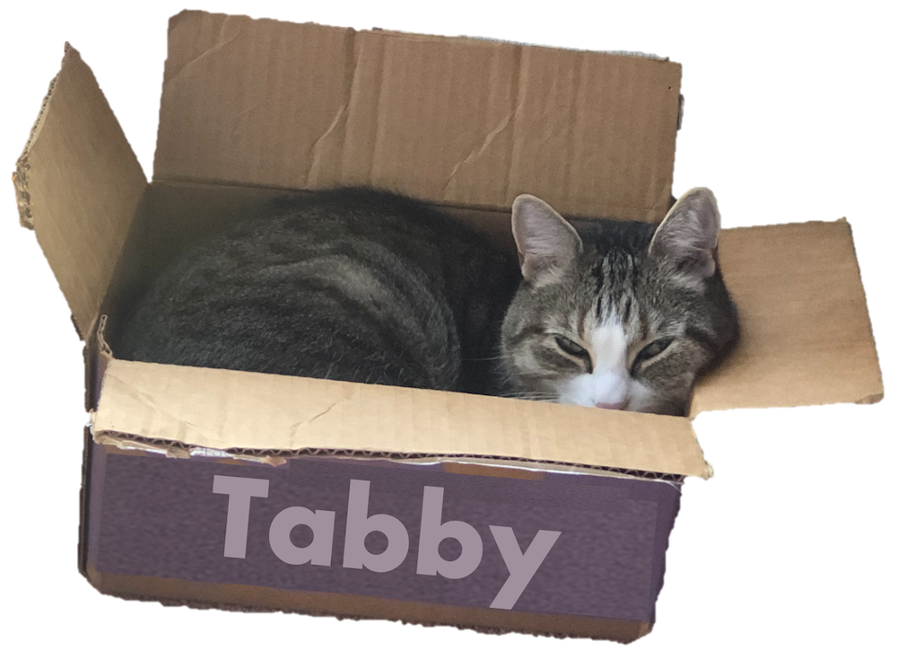

# Tabby: Tabular Data Synthesis with Language Models
**Use a pre-trained LLM to generate high-fidelity tabular data!**

<p align="center">
    
</p>


🧠 [Blog Post](link)<br>
📄 [Paper](link) <br>
🐈 [Demo notebook](https://github.com/soCromp/tabby/blob/main/demo.ipynb) <br>
🤗 [HuggingFace: sonicc/tabby-distilgpt2-diabetes](https://huggingface.co/sonicc/tabby-distilgpt2-diabetes) <br>

## Quick start

Follow the instructions below to install the necessary packages, then try things out with our simple pre-trained demo Tabby, or training and sampling your own Tabby!

### Environment Setup
Run the following:

```python
conda create --name tabby python=3.11.4
conda activate tabby
conda install pytorch torchvision torchaudio pytorch-cuda=12.1 -c pytorch -c nvidia
conda install tqdm matplotlib jupyter pandas scikit-learn jupyter
pip install transformers==4.44.2 accelerate datasets ucimlrepo openml bitsandbytes wandb openpyxl huggingface_hub
```

### Demo

We have created the [`demo.ipynb`]((https://github.com/soCromp/tabby/blob/main/demo.ipynb)) notebook as a quick and easy way to try out Tabby synthesis, no fine-tuning required!

### Working with Tabby

The `data-prep.ipynb` notebook will download and format datasets as they were prepared in our paper. If you wish to add a new dataset, just make sure it has similar file stricture, config file and train/val/test splits as those created in this notebook.

The file `trainplain.py` is the main point for interacting with our codebase. It allows you to train both Tabby and non-Tabby models, with or without Plain training.
Here is the command used to train our demo model:
```shell
python trainplain.py -p ./ckpt -d diabetes -mh -t -n 10
```
The `-p` flag indicates where to save the model checkpoints, training logs and samples, `-d` flag specificies the dataset, `-mh` means that MoE will be applied to the LM head, `-t` to perform training (defaults to Plain) and `-n` specifies the number of samples to produce after training. There are many other flags to specify various facets of training and sampling; to list them all run
```shell
python trainplain.py --help
```

Credit: Some code in the `src` directory is from the [Great](https://github.com/kathrinse/be_great) repository.

# Citation

If you use Tabby, please cite:

```bibtex
@article{cromp2025tabby,
  title={Tabby: Tabular Data Synthesis with Language Models},
  author={Sonia Cromp, Satya Sai Srinath Namburi GNVV, Mohammed Alkhudhayri, Catherine Cao, Samuel Guo, Nicholas Roberts, Frederic Sala},
  journal={arXiv preprint arXiv:2405.01147},
  year={2025},
  url={https://arxiv.org/abs/2405.01147}
}
```

# Contact
Thanks for checking out Tabby! We'd love to hear any thoughts you might have. Feel free to contact me (Sonia Cromp) at [cromp@wisc.edu].
